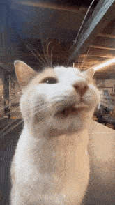

# Cat Breed Detection Using YOLOV8 🐱

[](https://www.python.org/downloads/)


This respitory is subjected for the necessities of infographics competition.

<p align="center">

</p>

Disclaimer: **FOR EDUCATIONAL PURPOSE ONLY! The contributors do not assume any responsibility for the use of this model.  We also don't claim for the misuse of the models.**

Warning: The result won't be 100% accurate.

## Our members 👤
Made with love by
```yaml
1. Rheyhan Fahry
2. Jonathan Marjono
```